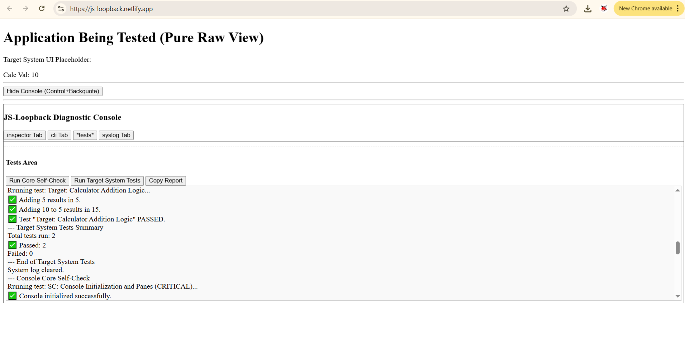

# JS-Loopback Diagnostic Console


[JS-Loopback Demo](https://js-loopback.netlify.app/)

## Overview

The JS-Loopback Diagnostic Console is a lightweight, in-browser debugging and testing tool designed for JavaScript applications. It is entirely self-contained within a single HTML file and uses no external CSS, making it ideal for environments with limited resources, constrained styling capabilities, or for focused, "raw" debugging sessions.

This tool provides developers with a suite of utilities to inspect, interact with, and test a target JavaScript system directly within the web page it's running on.

## Features

The console currently offers the following core functionalities:

1.  **Object Inspector:**
    *   Visually browse the properties and methods of a designated "target system" JavaScript object.
    *   Displays a navigable tree structure.
    *   Handles nested objects, arrays, functions, primitive types.
    *   Detects and indicates circular references.
    *   Configurable inspection depth.

2.  **Command Line Interface (CLI):**
    *   Execute JavaScript commands directly on the target system.
    *   Supports calling methods (e.g., `system.myMethod(arg1, "arg2")`) and accessing properties (e.g., `system.myProperty`).
    *   Basic argument parsing for numbers, strings (quoted), booleans (`true`/`false`), and `null`.
    *   Command history accessible via arrow keys.

3.  **Test Runner:**
    *   Define and execute JavaScript-based automated tests.
    *   Supports two categories of tests:
        *   **Core Self-Checks:** Tests designed to verify the functionality of the diagnostic console itself.
        *   **Target System Tests:** Tests written to validate the behavior of the application being debugged.
    *   Displays test results (pass/fail) in a dedicated report area.
    *   Ability to copy the test report to the clipboard.

4.  **System Log Capture:**
    *   Automatically captures all messages sent to the browser's native `console.log()`, `console.warn()`, `console.error()`, `console.info()`, and `console.debug()` methods.
    *   Displays these captured logs, timestamped and categorized by type, in a dedicated "System Log" tab.
    *   Allows copying the entire captured system log to the clipboard.
    *   Logs are still passed through to the browser's standard developer console.

5.  **Minimalist UI:**
    *   The console interface is constructed using basic HTML elements.
    *   Minimal inline styling is applied for core structure and readability, adhering to a "no external CSS" philosophy.
    *   Console visibility can be toggled using a button or a configurable keyboard shortcut (default: `Control+Backquote`).

## How to Use

1.  **Integration:**
    *   Include the provided HTML file (e.g., `index.html` or `console.html`) in your project.
    *   The `<script>` tag within the HTML contains the `RawCoreTester` class and an example `MockCalculator` class.
    *   To use the console with your own application:
        *   Instantiate your main application object (this will be the `targetSystemInstance`).
        *   Instantiate `RawCoreTester`, passing your application object and the ID of an HTML element where test reports should be displayed.
        ```javascript
        // Example (within a DOMContentLoaded listener or similar):
        const myApplication = new MyApplication(); // Your application's main object
        const consoleReportElementId = 'console-test-report-area'; // Ensure this element exists
        
        const diagnosticConsole = new RawCoreTester(myApplication, consoleReportElementId, {
            // Optional configuration options
            initialConsoleVisible: true,
            defaultTool: 'inspector'
        });
        ```

2.  **Running:**
    *   Simply open the HTML file in a web browser. The diagnostic console will initialize and (by default) become visible.

3.  **Interacting with the Console:**
    *   **Toggle Visibility:** Click the "Toggle Console" button or use the configured keystroke (default: `Control+Backquote`).
    *   **Tabs:** Switch between "Inspector", "CLI", "Tests", and "System Log" tabs to access different tools.
    *   **Inspector:** Browse the object tree. Click on `(+)` to expand nodes and `(-)` to collapse. Click "Refresh Inspector" if the target system's state has changed externally.
    *   **CLI:** Type commands like `system.methodName(arguments)` or `system.propertyName` and press Enter or click "Execute".
    *   **Tests:** Click "Run Core Self-Check" or "Run Target System Tests". Click "Copy Report" to copy the test results.
    *   **System Log:** View captured console messages. Click "Copy System Log" or "Clear System Log" as needed.

## Defining Tests

Tests are defined using the `coreTester.defineTest()` method:

```javascript
coreTester.defineTest(
    "Test Name Here", // Descriptive name for the test
    [ // Array of asynchronous test steps
        async function(systemInstance) { // 'this' refers to coreTester, 'systemInstance' is the target
            // Perform an action
            systemInstance.someAction();
            // Assert a condition
            return this._assert(systemInstance.getProperty() === "expectedValue", 
                                "Property has expected value.", 
                                "Property does NOT have expected value.");
        },
        async function(systemInstance) {
            // Another step...
            return this._assert(/* condition */, "Success msg", "Failure msg");
        }
    ],
    false,         // isCritical (boolean, optional, defaults to false)
    'target'       // testType ('target' or 'selfCheck', optional, defaults to 'target')
);
